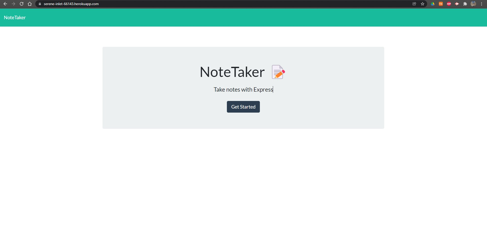
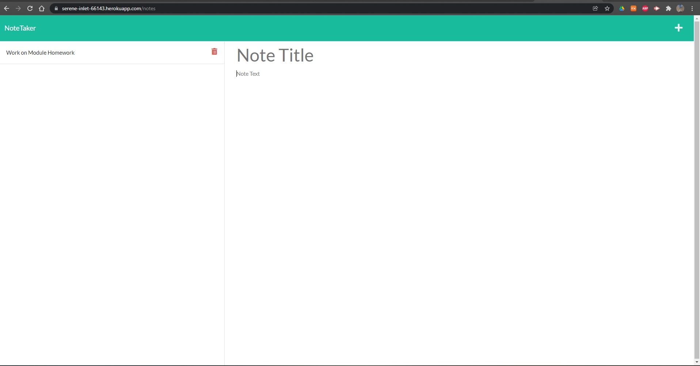

Unlicensed

# NoteTaker

## Description of Project

- This is a live web application that uses a .json database to save/load notes on enter. Using Express.js and Node.js, this application uses multiple webpages for data continuity. This was a solo project.

## Links

<a src="https://serene-inlet-66143.herokuapp.com/">Heroku Live Application </a>

##Table of Contents

- [Installation](#Installation)
- [Usage](#Usage)
- [License](#License)
- [Contributing](#Contributing)
- [Tests](#Tests)
- [Questions](#Questions)

# Installation

- How to install this application:  
  -- No need for installation, hosted on Heroku, if preferred for local storage, needs NPM, express, and node.js.

# Usage

Any and all can use this tool.

# License

The Unlicense

# Contributing

- How to contribute:  
  -- Ask me below if you'd like to contribute!

# Screenshots

- 
- 

# Questions

- If you have further questions, feel free to see my contact information below:  
  -- [GitHub](https://github.com/GunnySensei)  
  -- Email: gunnerwagoner@gmail.com
